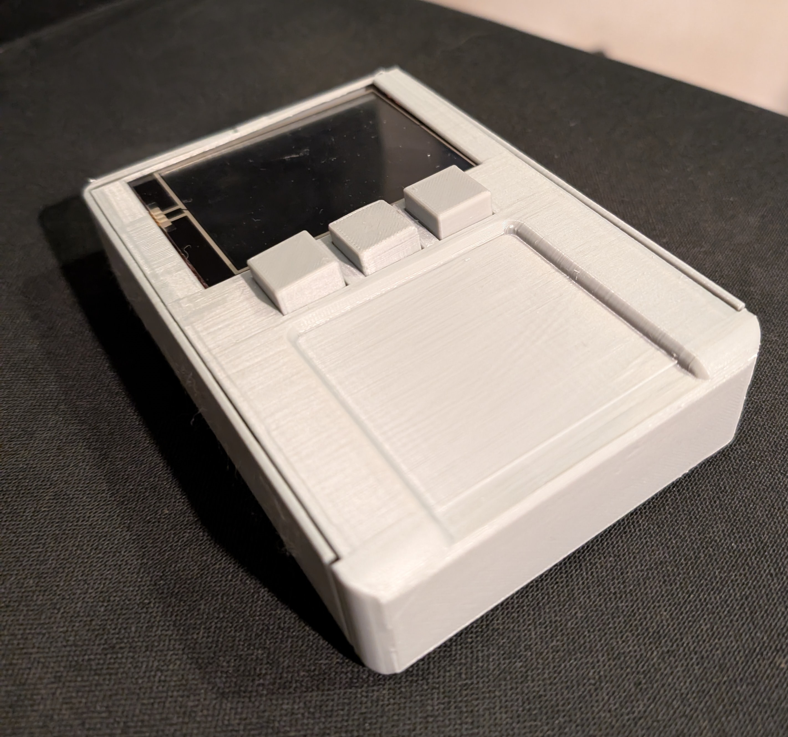
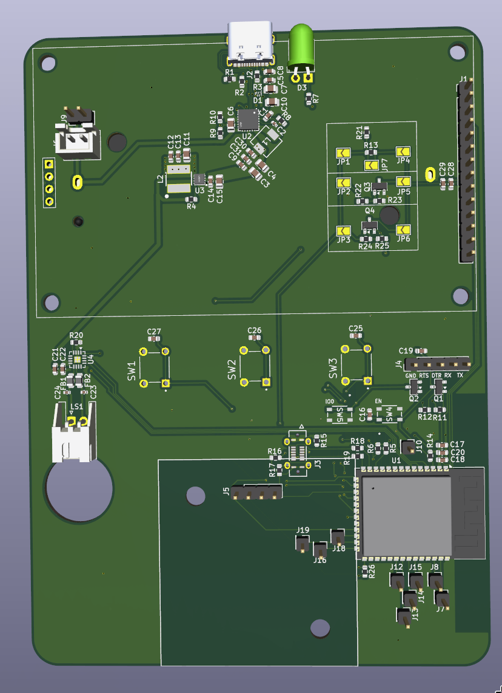
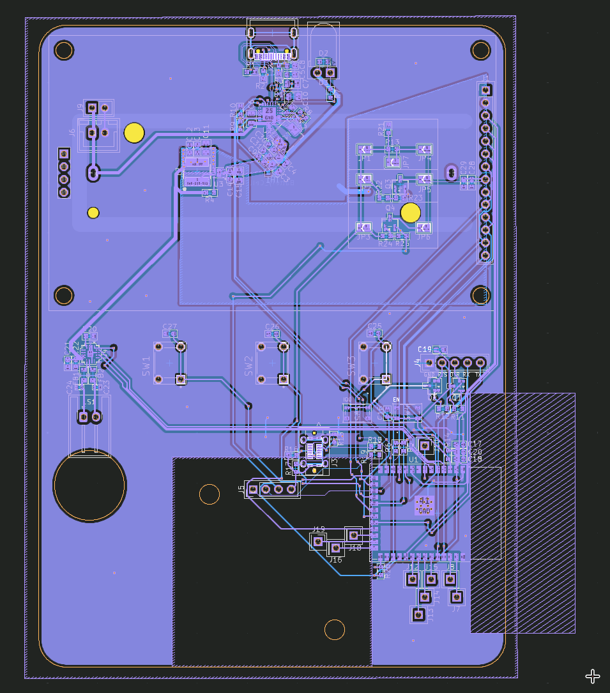
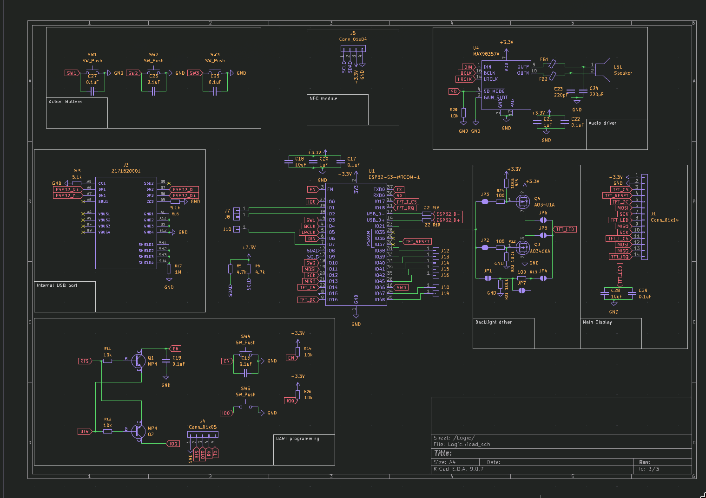
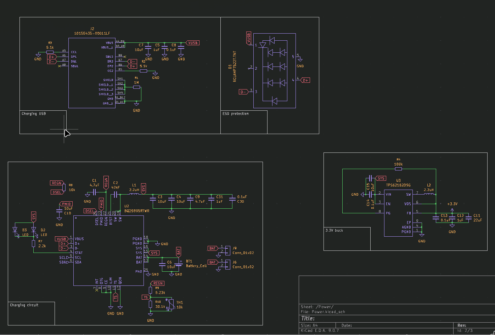
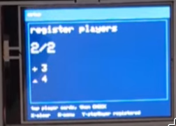
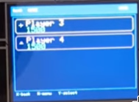
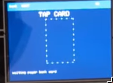

# Monopoly-Electronic-V2
This is a recreation of the classic Monopoly Electronic Banking game using modern technology. The project utilizes an ESP32 microcontroller to handle game logic and interactions, along with a Touch LCD display and RFID readers for player identification and transactions.

## Demo

[Demo Video](https://youtube.com/shorts/_shUK3fcT8k?feature=share)

## Images

### Final product

### CAD

Xray view - click to expand

### PCB

Schematic - click to expand

## Features
- Electronic banking system using RFID cards for a more reliable process.
- Support for multiple players with individual RFID cards.
- Real-time game state updates displayed on the LCD.
- Sound effects for an immersive gaming experience.
- Customizable game rules and settings.

## UI

### Player registration

### Main game screen

### Card interaction

## How the Game Works

Gameplay focuses on **NFC interaction instead of menus**.

Players throw the dice, and depending on where they land, they interact with the game console using their RFID cards. For example, if a player lands on a property, they can use their card to purchase it, or pay rent.

The game keeps track of each player's balance and properties, and updates the display accordingly. The use of RFID cards allows for a more seamless and engaging gaming experience, as players can quickly and easily interact with the game without navigating through complex menus. 

When a player has not enough money to pay rent or buy a property, they can choose to mortgage their properties or declare bankruptcy. The game will automatically handle these situations and update the game state accordingly.

If a player doesn't have enough money to pay rent, they will be bankrupt and removed from the game. The last player remaining with money wins the game.

### Card programming

To program the RFID cards, you can use the programming mode in the game console. Simply press the two side buttons simultaneously for 10 seconds to enter programming mode. Then, place the card you want to program on the console and follow the prompts on the LCD display to assign a player name, land.

## BOM (Bill of Materials)
| Index | MPN                      | Description                                          | pack quantity | price | TOTAL  |
| ----- | ------------------------ | ---------------------------------------------------- | ------------- | ----- | ------ |
| 1     | BQ25895RTWR              | IC BATT CHG LI-ION 1CELL 24WQFN                      | 2             | 6.58  | 178.39 |
| 2     | TPS62162DSGR             | IC REG BUCK 3.3V 1A 8WSON                            | 2             | 3.14  |        |
| 3     | RCLAMP7522T.TNT          | TVS DIODE 5VWM 25VC SLP1007N5T                       | 2             | 3.14  |        |
| 4     | ESP32-S3-WROOM-1-N8R8    | RF TXRX MOD BT WIFI PCB TH SMD                       | 2             | 12.26 |        |
| 5     | NFC RFID Wireless Module | https://es.aliexpress.com/item/1005006837891461.html | 1             | 4.45  |        |
| 6     | MF1 1k NFC card          | https://es.aliexpress.com/item/1005006127590709.html | 50            | 12.91 |        |
| 7     | 1043P                    | BATTERY HOLDER 18650 PC PIN                          | 2             | 5.62  |        |
| 8     | F51L-1A7H1-11020         | CONN FFC FPC BOTTOM 20POS 1MM RA                     | 2             | 1.12  |        |
| 9     | 10155435-00011LF         | USB TYPE C R/A SMT 16PIN                             | 2             | 1.56  |        |
| 10    | NSR10F20NXT5G            | DIODE SCHOTTKY 20V 1A 2DSN                           | 2             | 0.3   |        |
| 11    | SM5817PL-TP              | DIODE SCHOTTKY 20V 1A SOD123FL                       | 3             | 0.45  |        |
| 12    | BLM21PG221SN1D           | FERRITE BEAD 220 OHM 0805 1LN                        | 3             | 0.33  |        |
| 13    | GRM21BR61C106KE15K       | CAP CER 10UF 16V X5R 0805                            | 10            | 0.81  |        |
| 14    | GRM21BR61A226ME51L       | CAP CER 22UF 10V X5R 0805                            | 10            | 1.14  |        |
| 15    | GRM188R72A104KA35D       | CAP CER 0.1UF 100V X7R 0603                          | 17            | 1.48  |        |
| 16    | 104CDMCCDS-220MC         | FIXED IND 22UH 5A 66 MOHM SMD                        | 2             | 1.6   |        |
| 17    | 74404054022              | FIXED IND 2.2UH 3.8A 19 MOHM SMD                     | 2             | 2.4   |        |
| 18    | 104CDMCCDS-2R2MC         | FIXED IND 2.2UH 15A 7 MOHM SMD                       | 2             | 1.6   |        |
| 19    | SRP4020TA-2R2M           | FIXED IND 2.2UH 4A 61 MOHM SMD                       | 2             | 2.04  |        |
| 20    | BC847B                   | TRANS NPN 45V 0.1A SOT23-3                           | 4             | 0.44  |        |
| 21    | CL10B105KP8NNNC          | CAP CER 1UF 10V X7R 0603                             | 11            | 0.06  |        |
| 22    | GRM188Z71A475ME15D       | CAP CER 4.7UF 10V X7R 0603                           | 11            | 1.34  |        |
| 23    | GRM188Z71A475ME15D       | CAP CER 4.7UF 10V X7R 0603                           | 11            | 1.34  |        |
| 24    | GRM1555C1H221JA01D       | CAP CER 220PF 50V C0G/NP0 0402                       | 11            | 0.36  |        |
| 25    | GCJ188R71H473KA12D       | CAP CER 0.047UF 50V X7R 0603                         | 11            | 0.96  |        |
| 26    | GRM155R71E473KA88D       | CAP CER 0.047UF 25V X7R 0402                         | 10            | 0.22  |        |
| 27    | ERJ-3EKF1004V            | RES SMD 1M OHM 1% 1/10W 0603                         | 11            | 0.37  |        |
| 28    | ERJ-PA3F5101V            | RES SMD 5.1K OHM 1% 1/3W 0603                        | 11            | 0.75  |        |
| 29    | ERJ-PA3F1003V            | RES SMD 100K OHM 1% 1/3W 0603                        | 11            | 0.75  |        |
| 30    | ERJ-PA3F4701V            | RES SMD 4.7K OHM 1% 1/3W 0603                        | 11            | 0.75  |        |
| 31    | ERJ-PA3F2201V            | RES SMD 2.2K OHM 1% 1/3W 0603                        | 11            | 0.75  |        |
| 32    | ERJ-PA3F1002V            | RES SMD 10K OHM 1% 1/3W 0603                         | 11            | 0.75  |        |
| 33    | ERJ-3EKF5231V            | RES SMD 5.23K OHM 1% 1/10W 0603                      | 11            | 0.37  |        |
| 34    | ERJ-PB3D3012V            | RES SMD 30.1K OHM 0.5% 1/5W 0603                     | 11            | 0.81  |        |
| 35    | ERJ-3EKF1202V            | RES SMD 12K OHM 1% 1/10W 0603                        | 11            | 0.37  |        |
| 36    | ERJ-3EKF22R0V            | RES SMD 22 OHM 1% 1/10W 0603                         | 11            | 0.37  |        |
| 37    | NCU18XH103F6SRB          | THERMISTOR NTC 10KOHM 3380K 0603                     | 2             | 0.28  |        |
| 38    | TL1105BF160Q             | SWITCH TACTILE SPST-NO 0.05A 12V                     | 6             | 1.2   |        |
| 39    | SKRPABE010               | SWITCH TACTILE SPST-NO 0.05A 16V                     | 4             | 0.84  |        |
| 40    | SLR-56VRT32              | LED RED DIFFUSED T-1 3/4 T/H                         | 3             | 1.59  |        |
| 41    | AO3400A                  | 30V 5.8A 35MR@10V,5.8A 1.4W 1.4V                     | 3             | 0.54  |        |
| 42    | AO3401A                  | 30V 4.1A 65MR@10V,4.2A 350MW 1.3                     | 3             | 0.6   |        |
| 43    | Rubber Feets             | https://es.aliexpress.com/item/1005007247599206.html | 4             | 3.22  |        |
| 44    | PCB                      | JLCPCB                                               | 1             | 41.59 |        |
| 45    | M3x16 (DIN912)           | https://es.aliexpress.com/item/1005007118809249.html | 55            | 4.67  |        |
| 46    | M2.5x6 (DIN7991)         | https://es.aliexpress.com/item/1005007118809249.html | 55            | 4.19  |        |
| 47    | heatset inserts M2.5x3.5 | https://es.aliexpress.com/item/1005007342105110.html | 50            | 3.4   |        |
| 48    | heatset inserts M3x4.2   | https://es.aliexpress.com/item/1005007342105110.html | 50            | 3.92  |        |
| 49    | 8R 0.5W 40mm Speaker     | https://es.aliexpress.com/item/1005007949154095.html | 1             | 3.51  |        |
| 50    | 3.2" ST7789 with touch   | https://es.aliexpress.com/item/1005009929917954.html | 1             | 10.37 |        |
| 51    | heatset insert pinecil   | https://es.aliexpress.com/item/1005008145530885.html | 1             | 11.89 |        |
| 52    | Digikey VAT               |                                                       | 1             | 12.89 |        |

## License

This work is licensed under a
[Creative Commons Attribution-NonCommercial 4.0 International License][cc-by-nc].

[![CC BY-NC 4.0][cc-by-nc-image]][cc-by-nc]

[cc-by-nc]: https://creativecommons.org/licenses/by-nc/4.0/
[cc-by-nc-image]: https://licensebuttons.net/l/by-nc/4.0/88x31.png
[cc-by-nc-shield]: https://img.shields.io/badge/License-CC%20BY--NC%204.0-lightgrey.svg